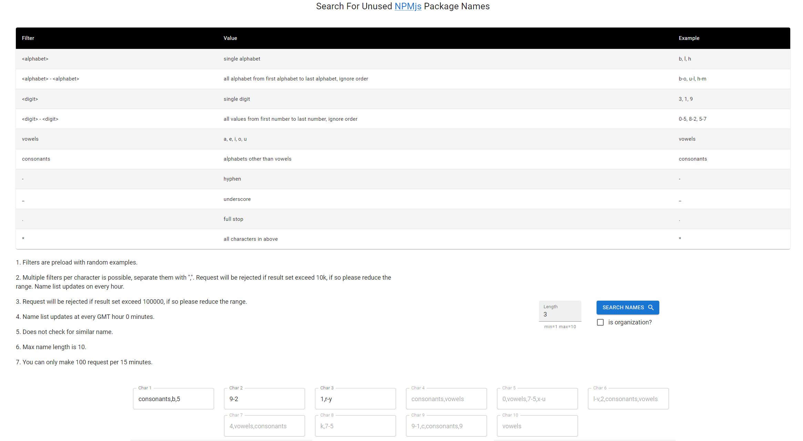
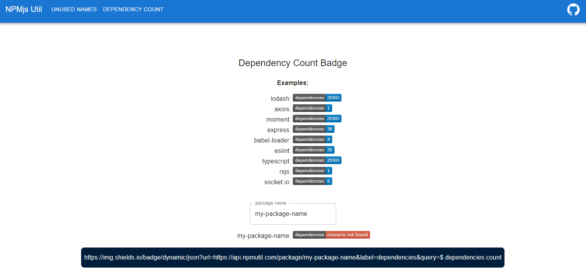

# npm util front end

 

Utility [website](https://npmutil.com) for open sourcerer to create NPMjs dependency count badge and search for unused package names.

It is also able to search for available organization names.

This is an open source project.

**Update: the website is no longer running**

[backend repo](https://github.com/tylim88/npm-util)

## Search Unused Names

## Dependency Count

